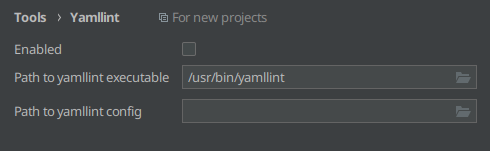
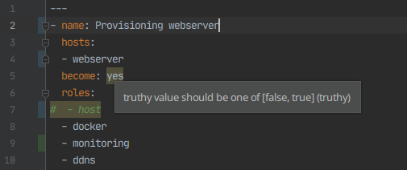

# Yamllint support for IntelliJ-based IDEs

A plugin providing static code analysis of Yaml files through integration with [Yamllint](https://yamllint.readthedocs.io).

[](https://plugins.jetbrains.com/plugin/15349-yamllint/versions)
[](https://plugins.jetbrains.com/plugin/15349-yamllint)
[](https://plugins.jetbrains.com/plugin/15349-yamllint/reviews)
[](https://github.com/aesy/yamllint-intellij/actions)
[](https://codecov.io/github/aesy/yamllint-intellij)
[](https://github.com/aesy/yamllint-intellij/blob/master/LICENSE)

## Installation 

Download and install the plugin through your IDE or through [the marketplace](https://plugins.jetbrains.com/plugin/https://plugins.jetbrains.com/plugin/15349-yamllint).

## Usage

Install Yamllint according to the [documentation](https://yamllint.readthedocs.io/en/stable/quickstart.html#installing-yamllint) and make sure it's in your PATH.

In your IDE, go to `Settings > Tools > Yamllint` and enable the plugin. The plugin will search for a binary and configuration file to try to populate the settings - adjust them if they are incorrect. Leave the configuration path empty to use the default settings. 



Open a Yaml file, warnings and errors should be displayed inline according to your settings!



## Development

#### Prerequisites

* [Gradle 5.2+](https://gradle.org/)
* [A Java 8+ Runtime](https://adoptopenjdk.net/)

#### Build

To compile and package the plugin, simply issue the following command:

```sh
$ ./gradlew buildPlugin
```

This will create a zip located in `build/distributions/`.

#### Test

Run the tests as you would in any other gradle project:

```sh
$ ./gradlew test
```

#### Run

To run the plugin from the command line, the following command can be used:

```sh
$ ./gradlew runIde
```

This will start IntelliJ Community with all necessary plugins loaded. Logs are located at 
`build/idea-sandbox/system/log/idea.log`.

## Contribute
Use the [issue tracker](https://github.com/aesy/yamllint-intellij/issues) to report bugs or make feature requests. 

## License
MIT, see [LICENSE](/LICENSE) file.
